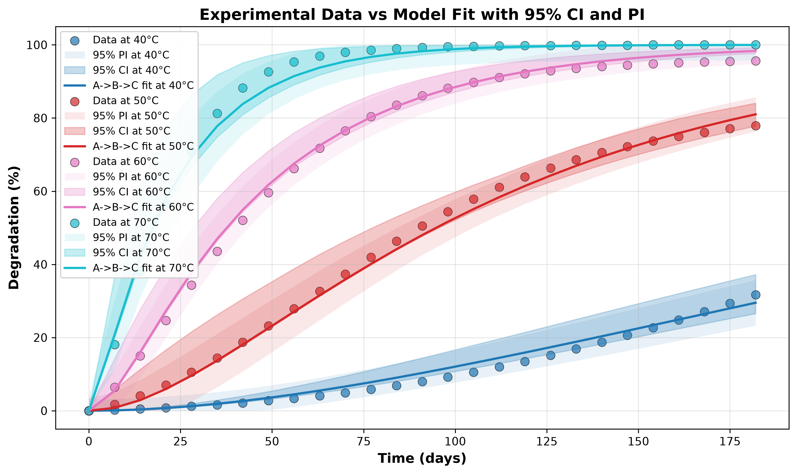

# AKTS: Python Library for Advanced Kinetic Analysis

[](https://opensource.org/licenses/MIT)

AKTS is a Python library for Arrhenius Kinetics Thermal Simulations. It analyzes thermoanalytical and reaction kinetics data (DSC, TGA, isothermal aging, protein/biologic stability studies) to determine kinetic parameters and predict material or product behavior over time and temperature.

---



## **[View rendered example isothermal stability report](https://raw.githack.com/PaulNobrega/akts/main/Examples/Isothermal/output/isothermal_stability_report.html)**
### Documentation

**[Complete Documentation](docs/README.md)**

### Quick Links

- **[Getting Started](docs/getting_started.md)** - Installation and first analysis
- **[Automated Analysis Guide](docs/automated_analysis.md)** - One-function workflow for non-experts
- **[ICH Q1E Compliance Guide](docs/ich_q1e_compliance.md)** - Regulatory-compliant shelf-life determination
- **[JSON I/O Specification](docs/json_io_specification.md)** - Web API integration
- **[API Reference](docs/api_reference.md)** - Complete function reference
- **[Kinetic Models Guide](docs/kinetic_models.md)** - Model equations and mechanisms
- **[Model Selection Guide](docs/model_selection_guide.md)** - Choosing the right model
- **[Model Selector Guide](docs/model_selector.md)** - IDE autocomplete for model discovery
- **[Experimental Design](docs/experimental_design.md)** - How to design experiments
- **[ODE Model Fitting](docs/bayesian_optimization.md)** - Multistart local fitting for consecutive/bimolecular reactions
- **[Temperature Units](docs/temperature_units.md)** - Working with K, C, and F
- **[Examples Guide](docs/examples.md)** - Example scripts and data
- **[Troubleshooting](docs/troubleshooting.md)** - Common issues

---

## Quick Start

### Installation

```bash
git clone https://github.com/PaulNobrega/akts.git
cd akts
pip install -r requirements.txt
pip install -e .
```

### For Non-Experts: One-Line Analysis

```python
from akts import models, auto_model_isothermal_data

# Automatic analysis with HTML report
results = auto_model_isothermal_data(
    data_files=['25C.csv', '40C.csv', '60C.csv'],
    models_to_try=models.kinetic.all,  # Use model selector for autocomplete
    predict=(2, 'year'),  # Predict 2 years ahead
    report_path='stability_report.html'
)

print(f"Best model: {results['selected_model']['model_name']}")
print(f"Shelf life: {results['predictions']['conversion_mean'][-1]:.1%}")
```

**[Read full automated analysis guide](docs/automated_analysis.md)**

### For Experts: Full Control

```python
import numpy as np
from akts import KineticDataset, fit_kinetic_model, run_bootstrap, predict_conversion

# Load or generate data
datasets = [...]  # Your KineticDataset objects

# Fit a model
fit_result = fit_kinetic_model(
    datasets=datasets,
    model_name="single_step",
    model_definition_args={'f_alpha_model': 'F1'},
    initial_guesses={'Ea': 85e3, 'A': 1e11},
    parameter_bounds={'Ea': (50e3, 150e3), 'A': (1e7, 1e14)}
)

# Get confidence intervals
bootstrap_result = run_bootstrap(
    datasets=datasets,
    fit_result=fit_result,
    n_iterations=100
)

# Predict long-term behavior
prediction = predict_conversion(
    kinetic_description=fit_result,
    temperature_program=(time_array, temp_array),
    bootstrap_result=bootstrap_result
)
```

**[Read full API reference](docs/api_reference.md)**

---

## Key Features

### Automated Analysis for Non-Experts
One function handles everything: loads data, tries models, ranks them, generates predictions with confidence intervals, and creates professional HTML reports.

### Model Selector with IDE Autocomplete
Type `models.` and see all available models organized by category (kinetic, empirical, ODE, model-free). No more remembering string names or looking up documentation. Safe concatenation: `models.kinetic.F1 + models.empirical.Linear` works perfectly.

### High-Performance Optimization
5-10x faster fitting through automatic closed-form solutions for isothermal data (3-5x speedup) and Numba JIT compilation for ODE integration (2-5x speedup). Vectorized predictions handle multi-year climate profiles efficiently.

### Advanced Model Validation
- Durbin-Watson autocorrelation check detects systematic residual patterns
- Physical plausibility filter flags or excludes unrealistic parameter values
- Bootstrap confidence intervals with automatic quality control filtering

### ICH Q1E Regulatory Compliance ✅
- **Full ICH Q1E compliance** for pharmaceutical stability submissions
- **Automatic one-sided 95% confidence bounds** (not two-sided intervals)
- **Confidence-band crossing method** for conservative shelf-life estimates
- **Auto-detection** of attribute direction from data type
- **Default enabled** with 5% specification limit
- Built-in ICH Q1E extrapolation ceiling calculation
- Interactive HTML reports include regulatory analysis section

**[Read ICH Q1E Compliance Guide](docs/ich_q1e_compliance.md)**

### Multistart ODE Fitting
Reliable fitting for multi-step reactions (A→B→C, A+B→C) via Arrhenius-reparameterized local optimization from several starting points.

### Temperature Unit Flexibility
Work in Kelvin, Celsius, or Fahrenheit with automatic conversion.

### Isoconversional Analysis
Model-free activation energy determination (Friedman, KAS, OFW) with direct model-free prediction and bootstrap confidence intervals.

### Model-Based Fitting
Global fits across multiple datasets with 17+ kinetic models (F-series, Avrami, diffusion, autocatalytic, ODE models).

### Model Discovery and Ranking
Automatic comparison of multiple models with statistical scoring (BIC, Akaike weights, adjusted R-squared, RMSE) and preference for the simplest model among statistically indistinguishable candidates.

### Long-Term Prediction
Extrapolate years ahead with confidence intervals for shelf-life studies, including direct time-to-target-conversion estimates.

### JSON API Support
Full input/output serialization for web application integration.

---

## Core Concepts

### Kinetic Models

Reaction rate: **dα/dt = k(T) · f(α)**

- **α** - conversion fraction (0 to 1)
- **k(T)** - Arrhenius rate constant: `k(T) = A · exp(-Ea / (R·T))`
- **f(α)** - reaction model function

AKTS fits **Ea** (activation energy) and **A** (pre-exponential factor) using:
- **Closed-form solutions** α(t) = g⁻¹(kt) for isothermal data
- **Numba JIT-compiled ODE integration** for non-isothermal profiles

**[Read kinetic models guide](docs/kinetic_models.md)**

### Available Models

**Simple models** (fast, 1-2 parameters). The default set tried by `auto_model_isothermal_data()` includes F0, F1, F2, F3, A2, A3, R2, R3, D2, D3, SB_mn, and Bna:

- **F0** - Zero-order (constant rate)
- **F1, F2, F3** - nth-order reactions
- **A2, A3** - Avrami-Erofeev (nucleation and growth)
- **D1, D2, D3, D4** - Diffusion-controlled
- **R1, R2, R3** - Contracting geometry
- **SB_mn** - Sestak-Berggren (general autocatalytic)
- **Bna** - Prout-Tompkins (autocatalytic)

**Complex models** (flexible, 4+ parameters), fit via multistart local optimization:

- **A→B→C** - Consecutive reactions
- **A+B→C** - Bimolecular reactions

**Empirical models** (fast algebraic fits with global Arrhenius):

- **First Order** - α = A·exp(-k(T)·t)
- **Linear** - α = k(T)·t + C
- **Square Root** - α = k(T)·√t + C
- **Logistic** - α = A/(1+B·exp(-k(T)·t))
- **Exponential** - α = A·(1-exp(-k(T)·t))+C

**Model-free**:

- **Friedman** isoconversional analysis predicts conversion directly from Ea(α) without assuming any f(α) model, with bootstrap confidence intervals

**[Read model selection guide](docs/model_selection_guide.md)**

### Model Selector

Easily discover and select models using the structured model selector:

```python
from akts import models

# Access models via dot notation (IDE autocomplete)
models_to_try = models.kinetic.all           # All mechanistic models
models_to_try = models.empirical.all         # All empirical models  
models_to_try = models.kinetic.F1            # Single model (returns ['F1'])
models_to_try = models.all                   # Everything

# Mix and match - safe concatenation
models_to_try = models.kinetic.F1 + models.kinetic.A2
models_to_try = models.kinetic.nth_order + models.empirical.all
models_to_try = models.empirical.all + models.kinetic.F0

# Sub-categories
models.kinetic.nth_order      # F0, F1, F2, F3
models.kinetic.nucleation     # A2, A3
models.kinetic.diffusion      # D2, D3
models.kinetic.autocatalytic  # SB_mn, Bna
```

**Benefits**:
- IDE autocomplete - Type `models.` and see all options
- No typos - Use `models.kinetic.F1` instead of `'F1'`
- Safe concatenation - All return lists, mixable
- Discoverability - Browse available models without docs

---

## Applications

### Pharmaceuticals and Biologics
- Shelf-life prediction from accelerated stability studies
- Protein/biologic formulation screening
- Cold chain risk assessment
- Regulatory submission data (ICH guidelines)

### Polymers and Materials
- Thermal decomposition and service lifetime prediction
- Thermoset curing optimization
- Formulation development (stabilizer screening)
- Quality control and batch comparison

### Quality Control
- Release testing and specifications
- Batch-to-batch comparison
- Change control assessment
- Failure investigation

**[Read experimental design guide](docs/experimental_design.md)**

---

## Dependencies

All dependencies are required:

- **NumPy** ≥1.20.0 - Numerical computing
- **SciPy** ≥1.7.0 - Optimization and integration
- **Matplotlib** ≥3.4.0 - Static plotting
- **Plotly** ≥5.0.0 - Interactive visualizations
- **pandas** ≥1.3.0 - Data handling
- **openpyxl** ≥3.0.0 - Excel file support

Optional (for running the test suite):

- **pytest** ≥7.0.0 - `pip install -e ".[test]"`

---

## Examples

Working examples with real data are included:

- **[Examples/Isothermal/](Examples/Isothermal/)** - Protein stability studies
- **[Examples/DSC/](Examples/DSC/)** - Differential scanning calorimetry
- **[Examples/TGA/](Examples/TGA/)** - Thermogravimetric analysis

**[Read examples guide](docs/examples.md)**

---

## License

MIT - see [LICENSE](LICENSE).

---

**Need help?** See [Troubleshooting Guide](docs/troubleshooting.md) or [open an issue](https://github.com/PaulNobrega/akts/issues).
